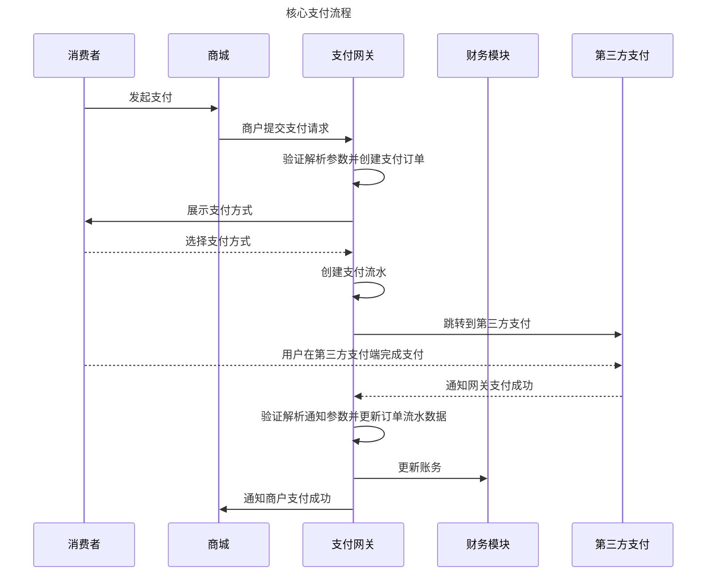

# 龙果支付业务流程分析

## 支付流程




## 对账流程

```flow

st=>start: 开始对账
fetchFiles=>operation: 获取对账文件
matchByPlatformRecord=>operation: 以平台订单为主与对账文件逐笔勾兑
hasUnMatchData=>condition: 一一检查是否匹配
matchByFileRecord=>operation: 以对账文件为主与对平台订单逐笔勾兑
hasUnMatchData2=>condition: 一一检查是否匹配
matchWithDiffPool=>operation: 与差错暂存池匹配
hasUnMatchData3=>condition: 不匹配
markRecord=>operation: 将该订单标记为银行长款
diffPool=>operation: 放入差错暂存池
e=>end: 结束对账

st->fetchFiles->matchByPlatformRecord->hasUnMatchData
hasUnMatchData(no)->diffPool
hasUnMatchData(yes)->matchByFileRecord->hasUnMatchData2
hasUnMatchData2(yes)->e
hasUnMatchData2(no, left)->matchWithDiffPool->hasUnMatchData3
hasUnMatchData3(yes)->markRecord
hasUnMatchData3(no)->e

```


```flow
st=>start: 开始定时跑批
readDiffPool=>operation: 读取暂存池数据
isExpired=>condition: 数据是否过期
markRecord=>operation: 将该订单标记为银行短款
e=>end: 结束跑批

st->readDiffPool->isExpired
isExpired(yes)->markRecord->e
isExpired(no)->e
```

## 结算流程

```flow
runBatch=>start: 开始定时跑批
setSafePeriodAndCard=>operation: 设置风险预存期和银行卡
dailyAccountStat=>operation: 每日统计账户历史并更新账户可结算余额
isAutoWithdraw=>condition: 是否自动提现
isCardSet=>condition: 是否设置了银行卡
isSettSatisfy=>condition: 是否满足了结算条件
genSettOrder=>operation: 生成结算单并冻结余额
auditSettOrder=>operation: 审核结算单
isAuditPass=>condition: 是否审核通过
transferMoney=>operation: 操作打款
transferSuccess=>condition: 是否打款成功
updateSettOrder=>operation: 解冻并减余额，更新结算单状态
uploadAttachment=>operation: 上传成功附件信息
markSettDeprecate=>operation: 解冻金额并更新结算单状态
e=>end: 结束

runBatch->setSafePeriodAndCard->dailyAccountStat->isAutoWithdraw
isAutoWithdraw(yes)->isCardSet
isCardSet(yes)->isSettSatisfy
isSettSatisfy(yes)->genSettOrder->auditSettOrder->isAuditPass
isAuditPass(yes)->transferMoney->transferSuccess
isAuditPass(no)->markSettDeprecate->e
transferSuccess(yes)->updateSettOrder->uploadAttachment->e
transferSuccess(no)->markSettDeprecate->e

```

