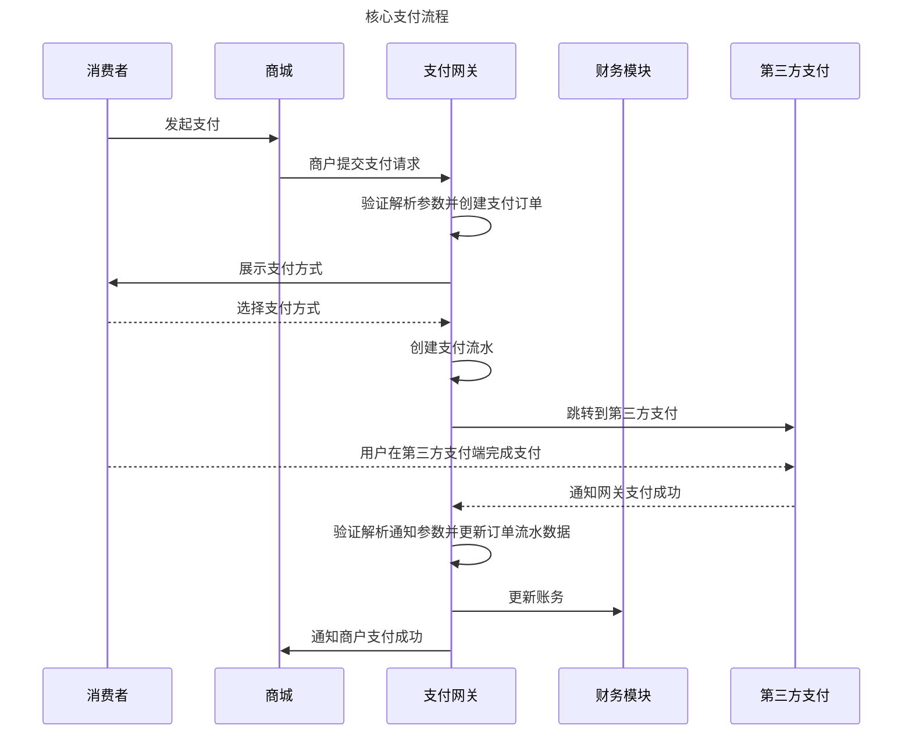

# 龙果支付业务流程分析

## 商户支付接口调用

```mermaid
sequenceDiagram
title: 核心支付流程
participant 消费者
participant 商城
participant 支付网关
participant 财务模块
participant 第三方支付

消费者->>商城: 发起支付
商城->>支付网关: 商户提交支付请求
支付网关->>支付网关: 验证解析参数并创建支付订单
支付网关->>消费者: 展示支付方式
消费者-->>支付网关: 选择支付方式
支付网关->>支付网关: 创建支付流水
支付网关->>第三方支付: 跳转到第三方支付
消费者-->>第三方支付: 用户在第三方支付端完成支付
第三方支付-->>支付网关: 通知网关支付成功
支付网关->>支付网关: 验证解析通知参数并更新订单流水数据
支付网关->>财务模块: 更新账务
支付网关->>商城: 通知商户支付成功


```

