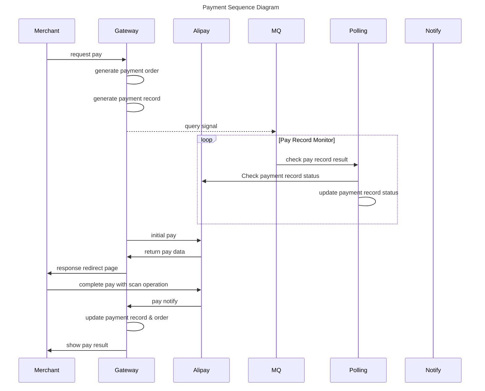

# 龙果支付业务流程分析

## 商户支付接口调用

```mermaid
%% 以支付宝扫码支付为例
sequenceDiagram
title: Payment Sequence Diagram
participant Merchant
participant Gateway
participant Alipay
participant MQ
participant Polling
participant Notify

Merchant->>Gateway: request pay
Gateway->Gateway: generate payment order
Gateway->Gateway: generate payment record
Gateway-->>MQ: query signal
loop Pay Record Monitor
	MQ->>Polling: check pay record result
	Polling->>Alipay: Check payment record status
	Polling->Polling: update payment record status
end
Gateway->>Alipay: initial pay
Alipay->>Gateway: return pay data
Gateway->>Merchant: response redirect page
Merchant->>Alipay: complete pay with scan operation
Alipay->>Gateway: pay notify
Gateway->Gateway: update payment record & order
Gateway->>Merchant: show pay result

```

